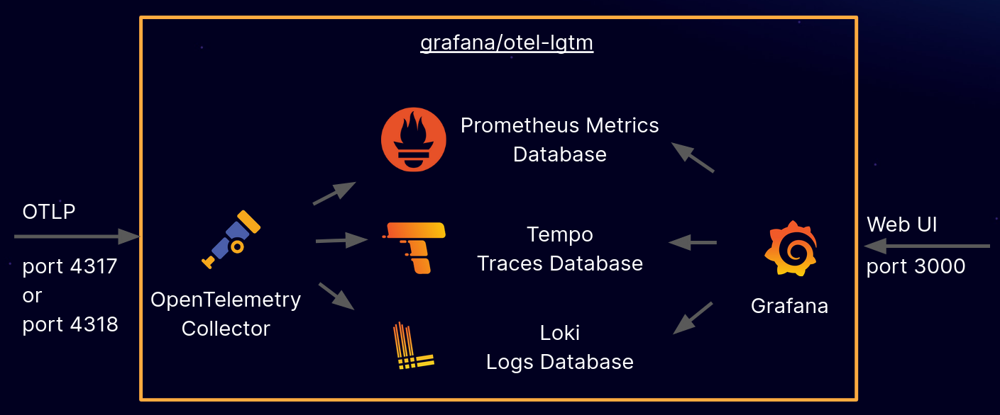

# cassandra-benchmarking
Cassandra Benchmarking Utilities

## Build

### Cassandra

In order to create a cassandra image, run the following

```bash
docker build -t ghcr.io/engineersbox/cassandra:5.0 -f docker/instance/cassandra.dockerfile .
```

You can optionally supply a repo and commit-ish marker to build from:

* `--build-arg="REPOSITORY=<repo>"` defaulting to <https://github.com/engineersbox/cassandra>
* `--build-arg="COMMIT_ISH=<commit | branch | tag>"` defaulting to `cassandra-5.0`
* `--build-arg="UID=<cassandra user uid>"` defaulting to `1000`
* `--build-arg="GID=<casasndra group id>"` defaulting to `1000`
* `--build-arg="OTEL_COLLECTOR_JAR_VERSION=<version>"` defaulting to `v2.2.0`
* `--build-arg="OTEL_JMX_JAR_VERSION=<version>"` defaulting to `v1.32.0`

The image can then be pushed to the GitHub container repository

```bash
docker push ghcr.io/engineersbox/cassandra:5.0
```

## OpenTelemetry Collector

```bash
docker build -t ghcr.io/engineersbox/otel-collector:latest -f docker/collector/otel.dockerfile .
```

* `--build-arg="OTEL_JMX_JAR_VERSION=<version>"` defaulting to `v1.32.0`

```bash
docker push ghcr.io/engineersbox/otel-collector:latest
```

## Startup

### Casandra

Starting cassandra is straightforward, it requires

```bash
docker run \
    -v "./config/cassandra:/etc/cassandra" \
    -v "./log:/var/lib/cassandra/logs" \
    --network=host \
    --user cassandra:cassandra \
    --detach \
    ghcr.io/engineersbox/cassandra:5.0
```

### OpenTelemetry Collector

```bash
docker run \
    --volume "./config/otel/otel-collector-config.yaml:/otel-lgtm/otelcol-config.yaml" \
    --volume "./log:/var/log/otel" \
    --network=host \
    --detach \
    ghcr.io/engineersbox/otel-collector:latest
```

## Configuration

* See the `start_cassandra.sh` script header for variables that can be set to customise the deployment.
* Cassandra can be configured via the `cassandra.yaml` file, there is documentation within the file describing all avilable properties and their usage.
* The OTEL agent can be configured via `otel.properties`, see <https://opentelemetry.io/docs/languages/java/automatic/configuration/> for details on valid properties.
* OTEL collector can be configured via `otel-collector-config.yaml`.

## Collector


